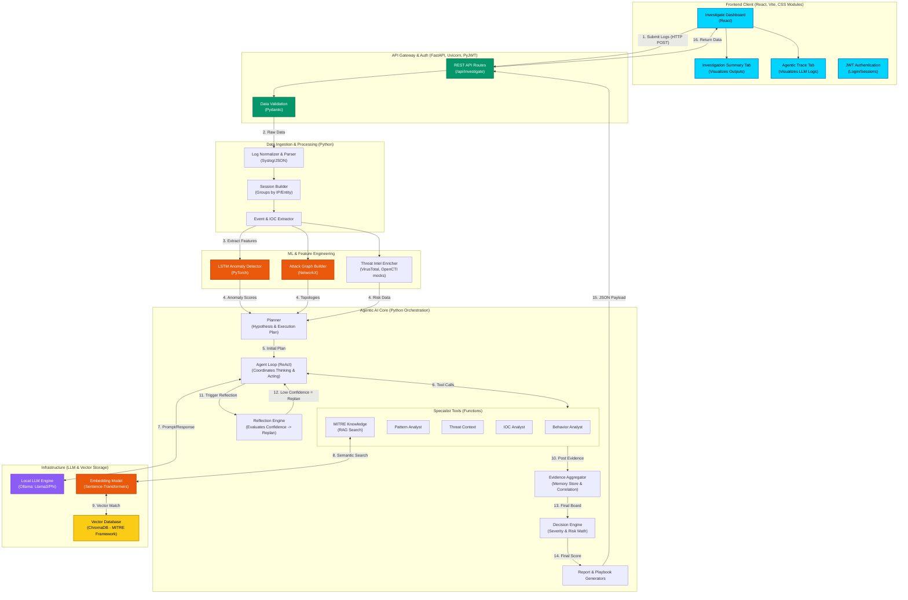

# LLM-Powered SOC Analyst — Comprehensive Architecture Diagram

This document contains a highly detailed, granular architecture diagram of the entire **LLM-Powered SOC Analyst** platform. It explicitly maps out all pipelines, internal engines, specific frameworks, and the tools used to power the system.

## Detailed Architecture Flow

---

## 3. Technology Stack Breakdown

### Frontend (Client-Side)
- **React.js**: Core component framework.
- **Vite**: Ultra-fast build tool and development server.
- **CSS Modules**: Scoped, component-level styling (used for the cyberpunk/neon dark-mode aesthetic).
- **Lucide React**: Vector icons used throughout the dashboard.

### Backend (Server-Side)
- **FastAPI**: Asynchronous Python web framework serving the REST API.
- **Uvicorn**: ASGI web server implementation.
- **Pydantic**: Data validation for strict typing of the frontend/backend JSON contracts.
- **PyJWT**: JSON Web Token implementation for analyst authentication.

### Machine Learning & Data Processing
- **PyTorch**: Deep learning framework powering the LSTM (Long Short-Term Memory) sequence anomaly detector.
- **NetworkX**: Graph theory library used to rebuild and map attack topologies from disparate log events.

### Agentic AI & Knowledge Base
- **Ollama**: Local execution environment for running Large Language Models (LLMs) completely offline, ensuring data privacy for security logs.
- **ChromaDB**: The vector database used for the RAG (Retrieval-Augmented Generation) pipeline.
- **Sentence-Transformers**: Generates semantic embeddings of the logs to query the MITRE ATT&CK framework stored in ChromaDB. 
