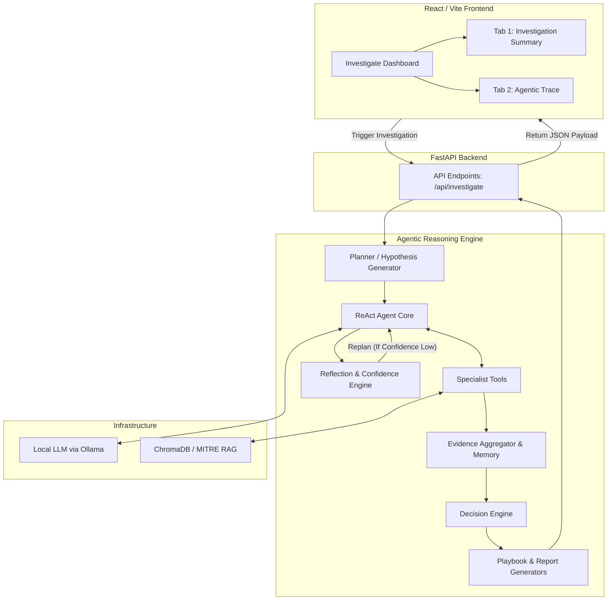

# LLM-Powered SOC Analyst — Final System Architecture

This document provides a crystal-clear, high-level overview of the final architecture for the **LLM-Powered SOC Analyst**. This system operates as an autonomous cybersecurity agent capable of investigating logs, synthesizing threat intelligence, executing specialized analysis, and generating response playbooks.

---

## 1. High-Level Pipeline Flow

---

## 2. Component Breakdown

### A. The Frontend Layer (React + Vite)
Located in `soc-react-frontend/`, the UI is built with a cyberpunk/dark-mode aesthetic using CSS Modules. It is responsible for presenting highly complex agentic data in an easily consumable format for human analysts. 

The main component is `InvestigationConsole.jsx`, which features a **Two-Tab Architecture**:
1. **Investigation Summary (The output):** Displays actionable intelligence including the Hypothesis, extracted MITRE ATT&CK Techniques, IOCs (IPs, Domains, Hashes), the Evidence Board, Entity Memory (cross-session tracking), Executive Report, and the tiered Response Playbook.
2. **Agentic Trace (The logic):** Displays the LLM's internal "thought process" for transparency. This includes the chronological Reasoning Trace, Reflection History (self-correction logs), Specialist Execution Logs (tool latency & confidence contribution), and Replan Events.

### B. The Backend API Layer (FastAPI)
Located in `backend/`, the FastAPI application acts as the RESTful bridge between the user and the AI.
- **`main.py`**: The entry point hosting routes like `/api/investigate` and `/api/auth/token`.
- **`api/auth.py`**: Handles JWT-based authentication.
- **`schemas.py`**: Strictly types inputs and outputs using Pydantic models to ensure the React UI receives predictable, structured JSON.

### C. The Agentic Reasoning Engine
Located in `backend/reasoning/`, this is the core intelligence of the system. Rather than using a single massive LLM prompt, the workload is delegated to autonomous components:
- **`planner.py`**: Reviews initial alerts and formulates a step-by-step investigation plan.
- **`agent_layer.py` / `llm_agent.py`**: Implements a ReAct (Reasoning and Acting) loop. It prompts the LLM to think, select a tool, and observe the output.
- **`agent_tools.py`**: Exposes "Specialists" to the agent. Examples include the *Behavior Analyst*, *IOC Analyst*, and *MITRE Knowledge* tool (which queries the RAG database).
- **`evidence_aggregator.py`**: Acts as the central whiteboard. As tools return data, this module synthesizes findings, recalculates running confidence/anomaly scores, and correlates entities across historical sessions.
- **`reflection.py`**: A crucial self-correction module. If the agent finishes a pass but the confidence score is too low, this module triggers a **Replan Event**, forcing the agent to try a different strategy.
- **`decision_engine.py`**: Deterministically finalizes severity and risk scores based on the accumulated evidence.
- **`playbooks.py` & `report_generator.py`**: Converts the raw agentic data into structured, human-readable formats (Immediate/Short-Term/Long-Term response actions).

### D. Data & Infrastructure Layer
- **Ollama**: The system connects to a locally hosted Ollama instance for all LLM inferences. This ensures zero data leakage of sensitive security logs to external APIs.
- **ChromaDB**: Hosts the vector embeddings of the MITRE ATT&CK framework. The `rag/rag_engine.py` queries this database to map raw log behaviors to known advanced persistent threat (APT) techniques.

---

## 3. The Autonomous Workflow Loop

1. **Ingest & Parse**: The backend receives a security log and normalizes it.
2. **Hypothesize**: The Planner formulates an initial theory (e.g., "This looks like an SSH brute force escalating to lateral movement").
3. **Execute & Gather**: The Agent invokes specialists to analyze behaviors and extract IOCs.
4. **Reflect**: The system evaluates its own findings. If the hypothesis is unproven, it replans.
5. **Conclude**: The Decision Engine finalizes the threat severity.
6. **Report**: Playbooks and reports are generated and beamed back to the React UI for the human analyst to review.
