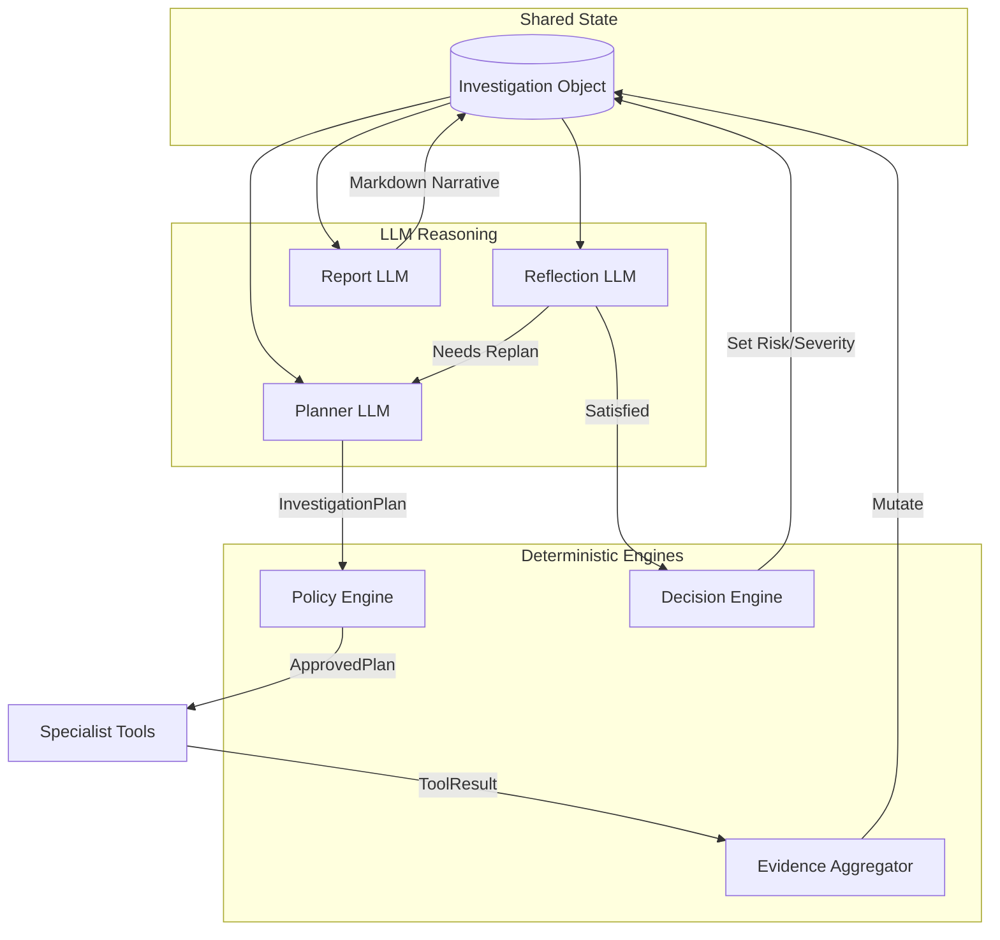

# Autonomous Agentic SOC Investigation Platform

[](https://www.python.org/)
[](https://fastapi.tiangolo.com/)
[](https://reactjs.org/)
[]()
[]()

> **This is NOT a traditional AI pipeline or a chatbot.**  
> The backend has been completely redesigned into a true **Autonomous Agentic SOC Investigation Platform**. It utilizes strict data contracts, deterministic guardrails, and dynamic reflection loops to automate cybersecurity investigations at an enterprise scale.

---

## 🌟 What's New in Version 5.1 (Production Review Update)
This release focuses on enterprise-grade reliability, local model compatibility, and deep explainability.

### 1. Robust Ollama (Local Model) Compatibility
- **`json_parser.py` Utility:** Introduced a resilient JSON parser that automatically cleans markdown fences, handles missing braces, and fixes trailing commas. This guarantees stability when using smaller local models like `Qwen3:4b` that occasionally output malformed JSON.
- **Structured Reflection Engine:** The Reflection phase now uses strict JSON schemas (`needs_more_evidence`, `expected_confidence_gain`, `contradictions_resolved`, `reasoning`), preventing the agentic loop from crashing during replanning.

### 2. Deep Agentic Tracing (UI & Backend)
- **Hierarchical Reasoning Trace:** The frontend "Agentic Trace" tab now features nested details. It explicitly displays hypotheses, execution strategies, and missing evidence at every phase (PLAN, EXECUTE, FUSE, REFLECT).
- **Skipped Tools Log:** The Specialist Execution Log now displays *all* tools. If the Policy Engine rejects a tool (e.g., over budget) or the Planner skips it, it is logged with a `SKIPPED` badge and an italicized explanation.

### 3. Dynamic Confidence Evolution
- **Progressive Scoring:** `main.py` now dynamically simulates the execution of tools to plot the confidence evolution step-by-step (e.g., Planner → Behavior → Threat Context → Decision).
- **Explainable Decision Engine:** The deterministic formulas are exposed via `confidence_breakdown` and `risk_breakdown` objects, driving visual UI metrics.

### 4. Hallucination Guardrails
- **Report Generator Constraints:** Added strict prompt guardrails forbidding the LLM from hallucinating IPs, domains, or attack vectors that are not explicitly present in the `InvestigationObject`'s evidence timeline.

---

## 🏗️ Architecture Overview: The Three Shared Contracts

The architecture revolves around three strict data contracts that isolate LLM reasoning from deterministic security logic:

1. **`InvestigationObject`**: The single source of truth for the entire investigation. It contains all session metadata, extracted events, tool outputs, and the final deterministic severity, risk, and confidence scores. **No duplicate state exists.**
2. **`InvestigationPlan`**: Generated *only* by the Planner LLM. Contains hypotheses, tool requirements, and execution strategies.
3. **`ToolResult`**: Returned by every specialist tool. Contains evidence, local confidence, metadata, and provenance.



---

## 🧠 The Agentic Loop

The investigation operates in a cyclical loop rather than a linear pipeline:

| Phase | Component | Logic Type | Description |
|---|---|---|---|
| **1. PERCEIVE** | Perception Layer | Deterministic | Normalizes logs and quarantines raw text from the LLM to prevent prompt injection. Initializes the `InvestigationObject`. |
| **2. PLAN** | Planner Engine | LLM Reasoning | Analyzes current state and generates an `InvestigationPlan` (hypothesis + required tools). **Cannot execute tools or score severity.** |
| **3. VALIDATE** | Policy Engine | Deterministic | Intercepts the plan, checking budgets and tool allowlists to output an `ApprovedPlan`. |
| **4. EXECUTE** | Tool Orchestrator | Deterministic | Executes specialist tools (Behavior LSTM, Pattern Match, Threat Intel, RAG MITRE, etc.) in parallel. |
| **5. AGGREGATE** | Evidence Aggregator | Deterministic | Merges `ToolResult`s directly into the `InvestigationObject`'s evidence timeline. Detects contradictions. |
| **6. REFLECT** | Reflection Engine | LLM Reasoning | Reviews the newly populated `InvestigationObject`. If evidence is insufficient, loops back to Phase 2. |
| **7. DECIDE** | Decision Engine | Deterministic | Mathematically computes **Risk**, **Severity**, and **Confidence**. No LLM hallucination allowed. |
| **8. REPORT** | Report Generator | LLM Reasoning | Generates the final human-readable markdown narrative based on the finalized state. |

---

## 🤖 Dynamic LLM Gateway Routing

The platform uses a centralized `llm_gateway.py` to route LLM requests based on your environment.

### 1. Local Testing Mode (Default)
By default (or if `ENV=local`), the platform operates entirely locally using **Ollama** as the primary provider. 
- **Primary**: Local Ollama Model
- **Config**: Reads `OPENROUTER_MODEL` (e.g. `qwen3:4b`) and `OPENAI_BASE_URL` (e.g. `http://localhost:11434/v1`) from your `.env`.

### 2. Production Mode
To enable production mode, set `ENV=production` in your `.env`. This enables a resilient fallback chain:
- **Primary**: OpenRouter (`OPENROUTER_API_KEY`)
- **First Fallback**: Google Gemini 2.5 Flash (`GEMINI_API_KEY`)
- **Second Fallback**: Local Ollama

---

## 📁 Project Structure

```text
LLM_Powered_SOC_ANALYST/
├── backend/
│   ├── main.py                        # FastAPI entry point & schema mappers
│   ├── schemas/
│   │   ├── __init__.py                # API response schemas (Frontend contracts)
│   │   └── investigation.py           # Core Architectural Contracts (InvestigationObject)
│   ├── perception/
│   │   └── __init__.py                # Phase 1: Pure deterministic parsing
│   └── reasoning/
│       ├── agent_layer.py             # Master Agentic Loop implementation
│       ├── planner.py                 # Phase 2: Hypothesis & Planning
│       ├── policy_engine.py           # Phase 3: Guardrails
│       ├── agent_tools.py             # Phase 4: Specialist Implementations
│       ├── evidence_aggregator.py     # Phase 5: State management
│       ├── reflection.py              # Phase 6: Sufficiency evaluation
│       ├── decision_engine.py         # Phase 7: Deterministic Scoring
│       ├── report_generator.py        # Phase 8: Narrative Generation
│       ├── llm_gateway.py             # Multi-provider LLM routing
│       └── memory.py                  # Cross-session entity correlation
```

---

## 🚀 Setup & Installation

### 1. Environment Setup
```bash
conda create -n rag_env python=3.11
conda activate rag_env
pip install fastapi uvicorn torch chromadb sentence-transformers python-jose passlib python-multipart openai requests pydantic pandas google-genai
```

### 2. Configuration (`.env`)
Create a `.env` file in the project root:
```env
# Set to 'production' to use OpenRouter/Gemini, or 'local' to use Ollama
ENV=local

# Local Ollama Config
OPENAI_BASE_URL=http://localhost:11434/v1
OPENROUTER_MODEL=qwen3:4b
OPENAI_API_KEY=ollama

# Production Config (Optional)
OPENROUTER_API_KEY=sk-or-v1-...
GEMINI_API_KEY=AIzaSy...

# Authentication
JWT_SECRET_KEY=your-super-secret-key-here
```

### 3. Run the Backend
```bash
uvicorn backend.main:app --reload
```
API runs at `http://localhost:8000`

### 4. Run the Frontend
```bash
cd soc-react-frontend
npm install
npm run dev
```
Frontend runs at `http://localhost:5173`

**Default Credentials:** `analyst` / `password123`
